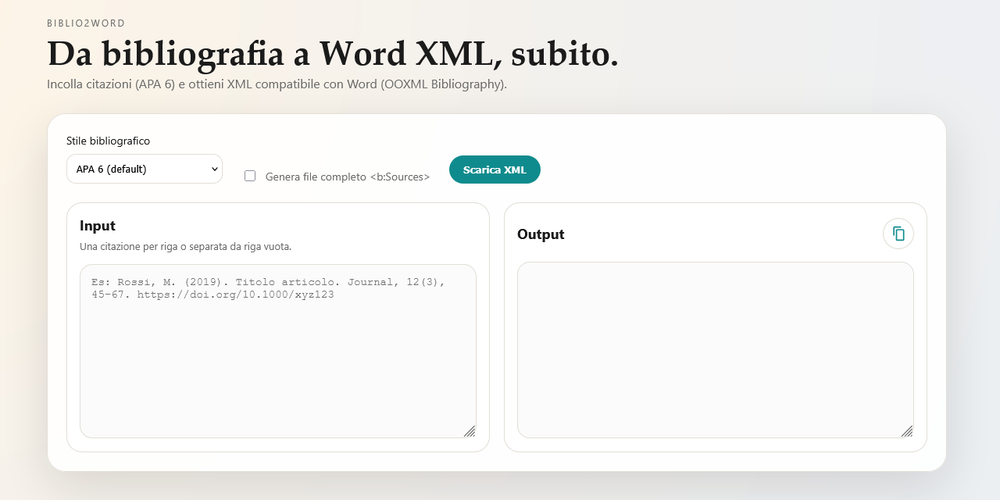

# biblio2word

Convertitore di citazioni bibliografiche in **Word Bibliography XML (OOXML)** secondo lo schema:
`http://schemas.openxmlformats.org/officeDocument/2006/bibliography`

Demo: https://silviotorre.github.io/biblio2word/

## Cosa fa
Incolli una o più citazioni e ottieni:
- singoli nodi `<b:Source>` copiabili
- opzionalmente un file completo `<b:Sources>` pronto per Word

## Stili supportati
- APA 6 (default)
- Chicago (beta)
- Harvard (beta)
- Vancouver (beta)
- OSCOLA (beta)

> Nota: i parser “beta” sono volutamente minimali (euristici). Funzionano su esempi comuni ma non coprono tutte le varianti.

## Come si usa (webapp)
1. Seleziona lo stile dal menu.
2. Incolla le citazioni nel box input (una per riga o separate da riga vuota).
3. Attiva la spunta “Genera file completo” se vuoi l’output con `<b:Sources>`.
4. Copia l’XML con l’icona oppure scarica il file.

## Esempi input
APA 6:
- Rossi, M. (2019). Titolo articolo. Journal, 12(3), 45-67. https://doi.org/10.1000/xyz123

Vancouver:
- 1. Rossi M, Bianchi L. Titolo articolo. Journal. 2019;12(3):45-67. doi:10.1000/xyz123

OSCOLA:
- Rossi, M, Titolo libro (Editore 2019)

## Struttura e pipeline
La normalizzazione avviene tramite **CSL-JSON** (usato da Zotero/Pandoc/citeproc).

Testo libero
→ parsing/normalizzazione
→ CSL-JSON
→ mapping CSL-JSON → Word OOXML Bibliography
→ XML finale

## Sviluppo
- Nessun framework, Vanilla JS modulare.
- I moduli sono in `src/` (parser, normalizzazione CSL, mapping Word XML).

Test:
- `npm test`